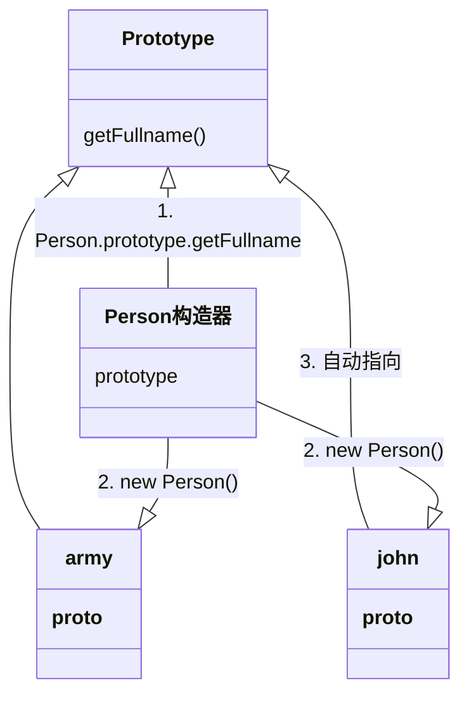

## 函数定义
一个函数是表示一个“行为”的值，我们可以在变量之间传递它们，并在需要时运行。

JS 中有四种方式定义一个函数：
- 函数声明
- 函数表达式
- ES6 中的箭头函数
- new Function()

### 函数声明
在主代码流中声明为单独的语句的函数。

```javascript
function 函数名(参数) {
	//函数语句
	return something;
}
```

### 函数表达式
在一个表达式中或另一个语法结构中创建的函数。常见在在赋值表达式 `=` 右侧创建：
```javascript
var/let/const 函数名(参数) {
	//函数语句
	return
};
```

### 函数声明 vs 函数表达式
1. 函数声明会被预解析，造成在当前作用域的声明提升，在函数声明之前可以调用；函数表达式的创建是在运行时赋值，在赋值完成之后才能调用；
2. 函数声明必须带有标识符（函数名称），表达式可省略：
	- 函数表达式如果带了名字，只能在函数内部使用；
	- 函数有一个name属性，指向紧跟在function关键字之后的那个函数名。如果函数表达式没有名字，那name属性指向变量名


## 函数的 prototype 属性
每个函数都有一个 `prototype` 属性，一般来说，普通函数的 `prototype` 属性的值是个空对象。
但当一个函数被当作构造器调用（用 `new` 调用）时，`prototype` 属性的值就开始发挥作用：
当 `new`操作符创建了一个空对象，就会把空对象的隐藏属性 [[prototype]] 指向构造函数`prototype` 属性的值，这就是所谓的基于原型的继承。




在创建构造器函数的时候，一般把属性写在构造函数内部，因为我们希望不同的对象可能会实例出不同的属性值；把方法写在 prototype 对象上。


### 练习
1. 下面代码的输出结果是什么
```javascript
/**
*1 sayHello(); // ‘how are you?’ 
*2 var sayHello = function() {
*3   console.log('Hello!')
*4 };
*5 sayHello(); // 'Hello!'
*6 function sayHello() {
*7 	console.log('How are you?')
*8 }
*9	sayHello(); // 'Hello!'
**/
```

预编译阶段：sayHello 函数被定义

执行阶段，执行到：

- 第 1 行调用 sayHello 函数，控制台打印出 "how are you?"；

- 第 2-4 行，创建匿名函数，复制给 sayHello 变量；

- 第 5 行，调用新的 sayHello 函数，控制台打印出 "Hello"；

- 第 6-8 行，已在预编译阶段定义，执行阶段略过；

- 第 9 行，调用 sayHello 函数，控制台打印出 "Hello"；

  

### 参考

1. [教程：函数表达式](https://zh.javascript.info/function-expressions)
2. [个人博客：关于 JavaScript 的函数声明和函数表达式](https://github.com/Wscats/articles/issues/73)
3. [个人博客：函数声明与函数表达式](https://segmentfault.com/a/1190000016496022)
